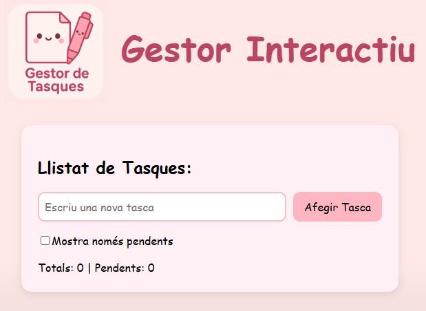

# Gestor_de_tasques_interactiu


Aquest projecte és un **Gestor de Tasques** creat amb **Vue 3**, estructurat en **components modulars** per millorar la mantenibilitat i llegibilitat del codi.

---

## Components principals

L’aplicació està dividida en quatre components principals:

1. **TaskApp.vue**  
   - És el component arrel.
   - Inclou el **HeaderComponent** i el component **TaskList**.
   - No gestiona directament dades de tasques.

2. **TaskList.vue**  
   - És el component que conté tota la **lògica de la llista de tasques**.
   - Gestiona l’array reactiu de tasques (`llista`) i les opcions de filtre.
   - Inclou **TaskForm** per afegir noves tasques i renderitza **TaskItem** per cada tasca.
   - Calcula totals i pendents amb propietats computades (`computed`).

3. **TaskForm.vue**  
   - Conté l’input i el botó per afegir tasques.
   - Emmet la nova tasca al component pare (**TaskList**) mitjançant `emit("add-task")`.
   - Manté l’estat local del text de l’input amb `ref`.

4. **TaskItem.vue**  
   - Representa una tasca individual.
   - Rep **props obligatòries**: `tasca` i `index`.
   - Permet marcar la tasca com a realitzada o eliminar-la, emetent esdeveniments al component pare.
   - El template aplica estil amb `class="done"` si la tasca està completada.

---

## Requisits previs

Abans de començar, assegurar-se de tenir instal·lades les següents eines:

- **Node.js**: comprova la versió amb `node -v`
- **npm (Node Package Manager)**: comprova la versió amb `npm -v`
- **Visual Studio Code** amb l’**extensió oficial de Vue** per facilitar el desenvolupament i l’autocompletat

---

## Creació del projecte Vue

Per crear el projecte Vue 3 utilitza:

```bash
cd nom_carpeta        # Crear el projecte dins la carpeta
npm create vue@latest
npm install
npm run dev           # Mode desenvolupament
npm run build         # Construir per producció
```

###
Autora: Silvia Serra
Assignatura: M14 (Desenvolupament d'aplicacions per entorns mòbils)
Any: 2025 / 2026 